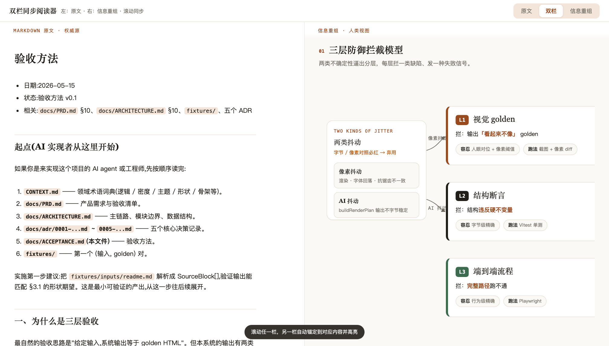
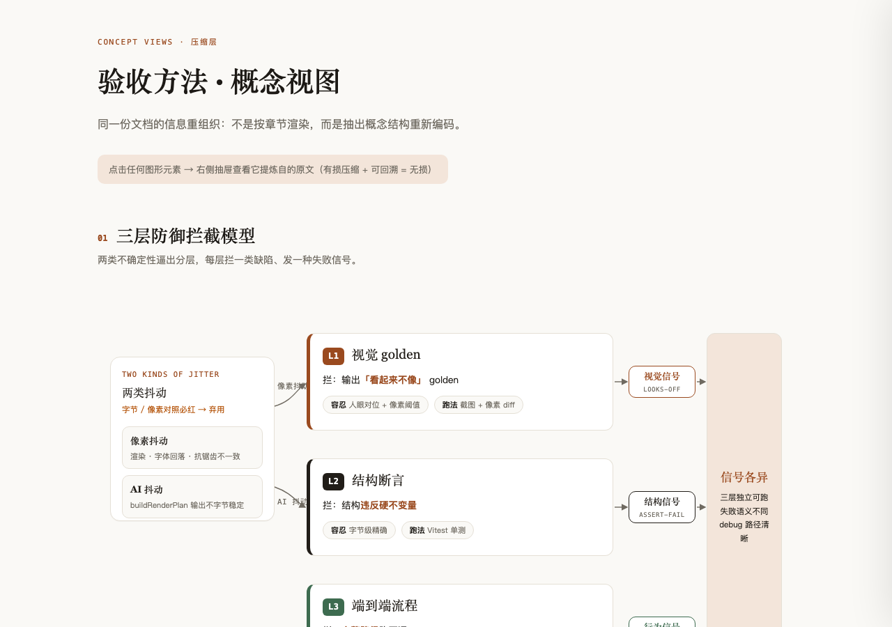

# md2view

> 把 Markdown 重新编码成人类真正读得进去的视图——不是渲染得好看，而是把**信息结构**抽出来换一种编码，且每个字都能一键回到原文出处。

`md2view` 是 md2html 的继任者：旧的转**格式**，新的转**视图**。



---

## 为什么需要它

AI 生成的文档越来越多，也越来越又长又臭。而人在任务之间高速切换，注意力是最稀缺的资源——一份超过一屏的文档，很难一点点把细节抠准。

问题的根不在"不够好看"，在**编码错位**：Markdown 是给 AI 和 git 读的线性文本，却被直接推给人一眼吸收。给一堵文字墙套上再漂亮的主题，它还是一堵墙。

`md2view` 的answer：**md 留给 AI，人读的是重新编码过的视图。**

## 核心洞察（设计理念）

**1. 源与视图分离。** Markdown 是给 AI 和 git 的**权威源**，HTML 是给人的**消费投影**。人读视图，AI 读 md，各得其所——不再让一份 md 同时伺候两个读者。

**2. 人类该读什么 = 信息重编码，不是加样式。** 按信息类型选最优编码：结构关系 → 图，数量对比 → 图表，流程 → 流程图，步骤命令 → 代码块，契约告警 → 短文本。这件事有个古老的名字，叫**信息设计**。忠实渲染 + 换主题那是 markdown viewer，市面一堆；`md2view` 只做重编码。

**3. 有损压缩 + 可回溯 = 无损。** 视图敢大胆压缩到一屏看懂，是因为每个视图元素都带 **source map**——点击下钻、或双栏滚动，一键回到它在原文的出处。左原文、右重组、滚动锚定同步，随时对照。这也是人工微调的定位手段：想改哪个元素，点它就找到了源。

**4. 保真靠对账，不靠模型自觉。** 来源盘点 → 义 → 理与据 → 图法 → 章法 → 确定性编译 → 独立验读，多层互相拦截：决策表每行和 checkbox 每项都有稳定原子锚点，弱模型不能再用一条总结吞掉整块；关系本体、fact 作用域、响应式、视觉密度和交互问题分别由合同、浏览器和独立 reviewer 抓出。只有全部通过，候选才会原子替换最终 HTML；失败时保留上一个可用版本。

**5. 它和市面工具正交。** 那一堆 md→html 工具（html-anything、visual-explainer…）是**美化器**，优化的是"第一眼有多好看"；`md2view` 是**可信重编码器**，优化的是"敢拿去做决策、敢溯源微调"。同维度拼好看赢不过美化器，换维度（可信 + 可溯源 + 重编码）才独一份。尤其是双栏滚动同步——它依赖 source map 才做得出（两栏长度不等，按百分比同步必错位），而 source map 恰恰是美化器都没有的那一环。

## 设计状态

当前生效版本是 **v3.1**，实际执行合同见 [SKILL.md](SKILL.md) 和 [PIPELINE.md](PIPELINE.md)，设计依据见 [DESIGN.md](DESIGN.md)。v3.1 已实现 `architecture / flow / matrix / argument` 四种 family renderer；`hierarchy / topology / timeline / dashboard` 只保留为 schema 词汇，选择后会 fail fast，不会偷偷退化成 flow。v2 仅保留旧自包含 reader 的静态快照兼容，不再用于生成新页面。

## 效果

同一份文档，四个层级的演进——前两级是"渲染加样式"，后两级才是 `md2view` 做的**信息重编码**：

| 层级 | 做的事 | 满意度 |
| --- | --- | --- |
| A · 排版渲染 | 线性文本 + 样式 | 只是好看的文字墙 |
| B · 结构渲染 | 线性文本 + 折叠/导航 | 仍与源同构 |
| **C · 概念重编码** | 抽概念结构 → 换成架构图/流程图/证据链 | 信息被重新组织 |
| **D · 数据重编码** | 数字密集文档 → dashboard（漏斗/趋势/分布/矩阵）| 一眼看懂结论 |

最终交付形态是**自适应双栏同步阅读器**：左栏原文、右栏重组，栏宽可拖动并记忆；顶部可切模式，滚动与点击都能按源块锚定联动。右栏用 family 专属空间语法、typed relations 和可溯源 scoped facts 做到决策完备，左栏只承担核证与细节下钻。标准门禁覆盖 1440 / 1280 / 1024 / 768，最低支持 768，不做手机适配。



## v3.1 六段流水线

执行面把“来源盘点”和“义”合为第一段，但内部顺序仍不可颠倒：

1. **来源盘点 + 义** — `parse_blocks.py` 建立不可变 blocks/sourceUnits；模型声明 audience、readerTask、中心命题、问题与页面叙事，不先选布局。
2. **理与据** — 模型在 `view-spec.json` 中声明 entities、typed relations、scoped facts、`stateKind` 和 source map。
3. **图法** — 按主问题选择 architecture、flow、matrix 或 argument；主关系与 family 不兼容就拆图或重选。
4. **章法** — 用受限 region tree、readingPath、focalIds 组织空间、边界、阅读路径和主次。
5. **确定性编译** — `assemble_v3.py` 校验合同并由 family renderer 生成候选；模型不写 HTML/CSS/SVG。
6. **独立盲读 + 原子晋升** — 真实浏览器截图后，独立 reviewer 先盲读再对账；候选 SHA256、reviewer/producer 独立性、全部主关系与 facts 和浏览器门都通过，`build_reader.py v3` 才替换最终文件。

细节见 [PIPELINE.md](PIPELINE.md)。

### v3.1：语义与章法归 spec，表达归 family renderer

模型只输出结构化 `view-spec.json`。`diagramKind` 决定问题家族，relation ontology 决定关系语义，region tree 决定空间骨架；renderer 再确定 DOM 与视觉编码。结构关系优先用嵌套/层带，动态关系才使用方向，matrix 使用真实行列轴，argument 以 claim 与 evidence 的论证关系为中心。`stateKind: start / intermediate / terminal / persistent` 明确 flow 的状态角色。

旧的 v2 `reader.html` 是自包含快照，可继续打开；旧 fragments 不会透明升级。要获得 v3 能力，必须重新生成 `view-spec.json`，项目不维护长期双轨生成合同。

## 安装

```bash
git clone https://github.com/hanzhangzzz/my-skill.git
cp -r my-skill/md2view ~/.claude/skills/     # Claude Code
# 或 ~/.codex/skills/ （Codex）
```

`scripts/` 里的 Python 脚本零第三方依赖；视觉校验环的 `shot.js` 必须能加载 `@playwright/test` 或 `playwright`，并安装 Chromium。依赖可位于当前项目、npm 全局目录，或由 `MD2VIEW_PLAYWRIGHT_ROOT=/abs/project` 指向另一个已安装项目。

## 用法

对着 Claude Code 说「把这份 md 变成视图 / 双栏看」，或 `/md2view`，它会按六段把文档跑成 `reader.html`。

最终出口是：

```bash
python3 scripts/build_reader.py v3 \
  blocks.json view-spec.json reader.html \
  --visual-verdict visual-verdict.json \
  --producer-id <本次生产者稳定ID> \
  --shots-dir shots
```

审阅前可用 `assemble_v3.py blocks.json view-spec.json reader.candidate.html` 生成候选，但候选不是最终交付物。`visual-verdict.json` 必须绑定该候选的 SHA256；`reviewer.id` 必须与 `--producer-id` 不同。最终命令会重新编译并重跑浏览器、digest、身份和 spec 覆盖门禁。

**适合**：信息结构厚的文档（复盘、报告、规格、长 README，章节/表格/数字/逻辑关系多），要给人读或分享。
**不适合**：只要把 md 忠实转成带样式 html——那是普通渲染，别用它。

## 成本

一次可靠转换至少包含生产建模与独立盲读两个角色，并要运行确定性编译和真实浏览器门。调用数取决于视图数量和返工轮次；成本花在纠正心智模型与核证来源，而不是让多个 agent 各自手写 HTML。

---

*md2view 继承 md2html 的哲学（md 为源、溯源、反 AI slop），但重新划分了职责：AI 负责义、理据、图法与受限章法，确定性 family renderer 负责 DOM、视觉与交互；保真靠 source map、浏览器门和独立验读。*
